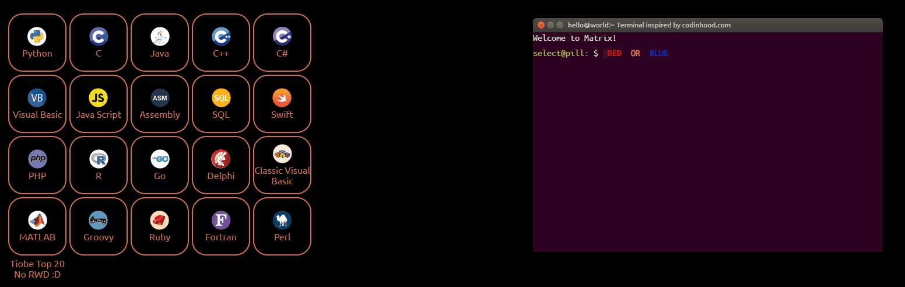
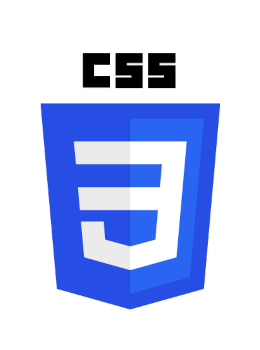
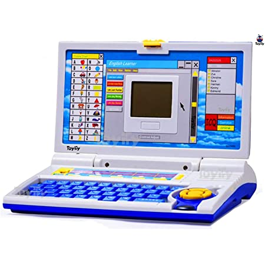

<h1>Language Chooser</h1>

 

# Don't know what technology to use to write a project?  
# Don't know what buzzword to put on your CV?  
# Pick a programming language and impress your CEO!  

 
 
 

<h6>No RWD version :D</h6>

 
 
 

Used technologies:   
  
  
  
  
  
  